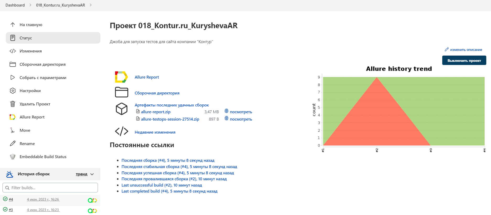

# Проект по автоматизации тестовых сценариев для сайта компании "Контур"


## :scroll: Содержание:

- <a href="#tools"> Стек используемых технологий</a>
- <a href="#checking"> Реализованные проверки</a>
- <a href="#console"> Запуск автотестов</a>
- <a href="#jenkins"> Сборка в Jenkins</a>
- <a href="#allureReport"> Пример Allure-отчета</a>
- <a href="#allure"> Интеграция с Allure TestOps</a>
- <a href="#jira"> Интеграция с Jira</a>
- <a href="#tg"> Уведомления в Telegram с использованием бота</a>
- <a href="#video"> Видео примера запуска тестов в Selenoid</a>

<a id="tools"></a>
## :computer: Стек используемых технологий

<p align="center">


</p>

Тесты в данном проекте написаны на языке <code>Java</code> с использованием фреймворка для тестирования [Selenide](https://selenide.org/), сборщик - <code>Gradle</code>. 

<code>JUnit 5</code> задействован в качестве фреймворка модульного тестирования.
При прогоне тестов для запуска браузеров используется [Selenoid](https://aerokube.com/selenoid/).

Для удаленного запуска реализована джоба в <code>Jenkins</code> с формированием Allure-отчета и отправкой результатов в <code>Telegram</code> при помощи бота. Так же реализована интеграция с <code>Allure TestOps</code> и <code>Jira</code>.

Содержание Allure-отчета:
* Шаги теста;
* Скриншот страницы на последнем шаге;
* Page Source;
* Логи браузерной консоли;
* Видео выполнения автотеста.

<a id="checking"></a>
## :male_detective:: Реализованные проверки

Автаматизированные тесты
- ✓ Выбор города в поиске вакансий
- ✓ Проверка наличия почтового адреса на странице 'Вакансии'
- ✓ Проверка страницы 'Кандидатам'
- ✓ Наличие юридического адреса компании
- ✓ Выбор города для обучения
- ✓ Проверка наличия почтового адреса на странице 'Студентам'
- ✓ Проверка перехода на страницу Википедии
- ✓ Сообщение о неверно заполненном поле адреса почты в разделе 'Новости'
- ✓ Сообщение о незаполненном поле адреса почты в разделе 'Новости'

Ручные тесты
- ✓ Наличие Лицензии
- ✓ Открытие почтового агента
- ✓ Открытие страницы Люди
  <a id="console"></a>
## :arrow_forward: Запуск автотестов

### Запуск тестов из терминала

Локальный запуск:
```
gradle clean test 
```
Удаленный запуск:
```
clean
test
-DremoteUrl=${REMOTE}
-DbrowserSize=${BROWSER_SIZE}
-DbrowserVersion=${BROWSER_VERSION}
-Dbrowser=${BROWSER}
-DbaseUrl=${BASEURL}
```
или
```
clean gradle test -Denv='remote'
```
<a id="jenkins"></a>
##  </a> Сборка в <a target="_blank" href="https://jenkins.autotests.cloud/job/018_Kontur.ru_KuryshevaAR/"> Jenkins </a>

Для запуска сборки необходимо перейти в раздел <code>Собрать с параметрами</code>, выбрать необходимые параметры и нажать кнопку <code>Собрать</code>.
#### :hammer_and_wrench:: Параметры сборки в Jenkins:
- BASE_URL (адрес основной страницы тестируемого сайта)
- REMOTE_URL (адрес удаленного сервера)
- BROWSER_SIZE (размер окна браузера, по умолчанию 1920x1080)
- BROWSER_VERSION (версия браузера, по умолчанию 100.0)
- BROWSER (браузер, по умолчанию chrome)
<p align="center">

</p>
После выполнения сборки, в блоке <code>История сборок</code> напротив номера сборки появятся значки <code>Allure Report</code> и <code>Allure TestOps</code>, при клике на которые откроется страница с сформированным html-отчетом и тестовой документацией соответственно.

<a id="allureReport"></a>
##  </a> Пример <a target="_blank" href="https://jenkins.autotests.cloud/job/018_Kontur.ru_KuryshevaAR/4/allure/"> Allure-отчета </a>  
### Overview

<p align="center">

</p>

<a id="allure"></a>
##  </a> Интеграция с <a target="_blank" href="https://allure.autotests.cloud/project/2238/dashboards"> Allure TestOps </a> 

На *Dashboard* в <code>Allure TestOps</code> видна статистика количества тестов: сколько из них добавлены и проходятся вручную, сколько автоматизированы. Новые тесты, а так же результаты прогона приходят по интеграции при каждом запуске сборки.

<p align="center">

</p>

### Результат выполнения автотеста

<p align="center">

</p>

### :runner:: Прогоны
<p align="center">

</p>

<a id="jira"></a>
##  </a> Интеграция с <a target="_blank" href="https://jira.autotests.cloud/browse/HOMEWORK-694"> Jira </a> 

Реализована интеграция <code>Allure TestOps</code> с <code>Jira</code>, в тикете отображается, какие тест-кейсы были написаны в рамках задачи и результат их прогона.

<p align="center">

</p>

<a id="tg"></a>
##  Уведомления в Telegram с использованием бота

После завершения сборки специальный бот, созданный в <code>Telegram</code>, автоматически обрабатывает и отправляет сообщение с отчетом о прогоне тестов.

<p align="center">

</p>

<a id="video"></a>
##  Видео примера запуска тестов в Selenoid

В отчетах Allure для каждого теста прикреплен не только скриншот, но и видео прохождения теста
<p align="center">
  
</p>
